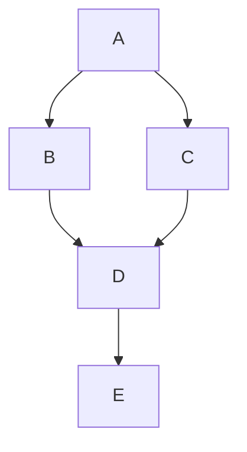
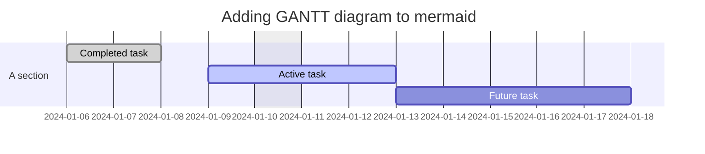
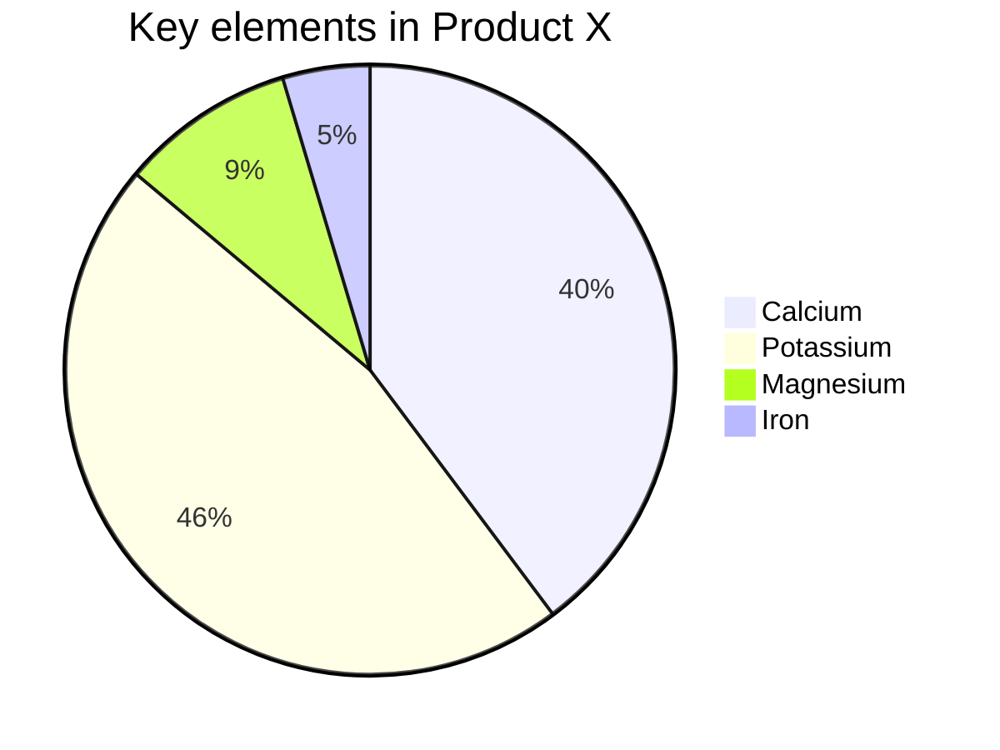

## 前言

使用 mermaid 标签可以绘制 Flowchart（流程图）、Sequence diagram（时序图 ）、Class Diagram（类別图）、State Diagram（状态图）、Gantt（甘特图）和 Pie Chart（圆形图），具体可以查看[mermaid文档](https://mermaid-js.github.io/mermaid/)。

## 示例一：基本的流程图


graph TD;
    A-->B;
    A-->C;
    B-->D;
    C-->D;
    D-->E;


## 示例二：甘特图


gantt
  dateFormat  YYYY-MM-DD
  title Adding GANTT diagram to mermaid
  excludes weekdays 2024-01-10

  section A section
  Completed task            :done,    des1, 2024-01-06,2024-01-08
  Active task               :active,  des2, 2024-01-09, 3d
  Future task               :         des3, after des2, 5d


## 示例三：饼图


pie
  title Key elements in Product X
  "Calcium" : 42.96
  "Potassium" : 50.05
  "Magnesium" : 10.01
  "Iron" : 5

