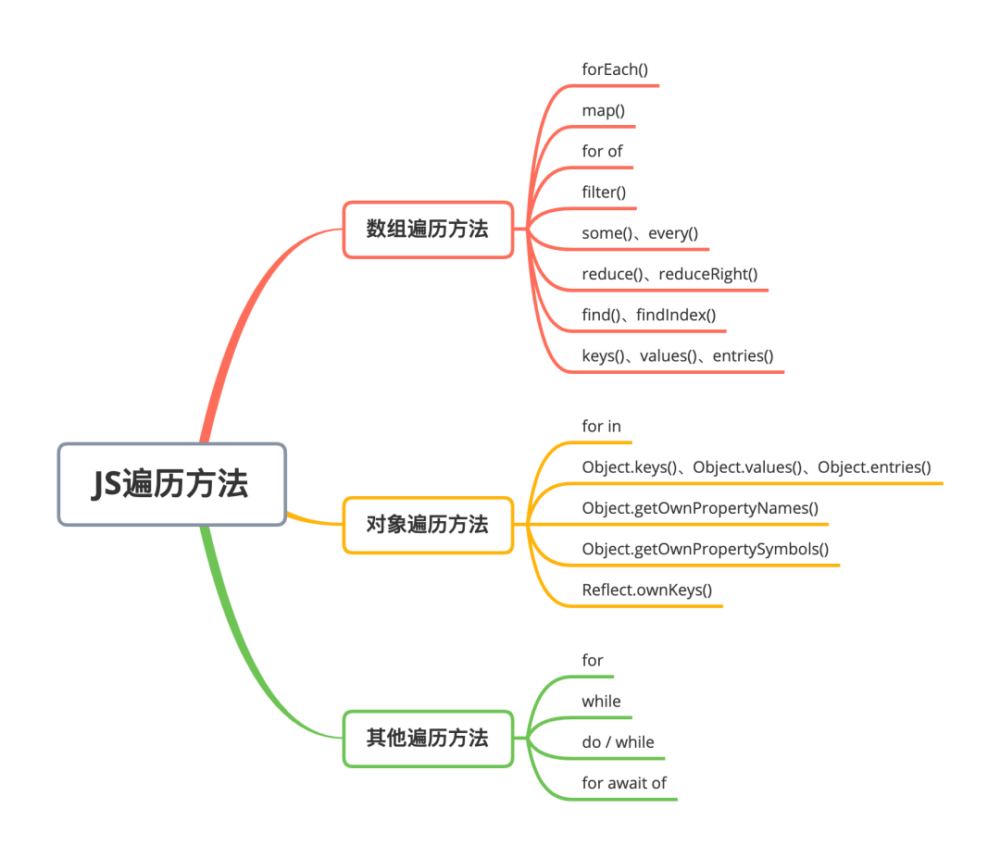

在 hexo 官司网中对[资源文件夹](https://hexo.io/zh-cn/docs/asset-folders)的说明，将`config.yml`文件中的`post_asset_folder`选项设为 true，创建新文章时自动创建一个同名文件夹。可以通过相对路径来引用它们

## 使用 Markdown 嵌入图片

hexo-renderer-marked 3.1.0 引入了一个新的选项，其允许你无需使用 asset_img 标签插件就可以在 markdown 中嵌入图片

如需启用：

```
# _config.yml
post_asset_folder: true
marked:
  prependRoot: true
  postAsset: true
```

启用后，资源图片将会被自动解析为其对应文章的路径。
例如： image.jpg 位置为 `/2020/01/02/foo/image.jpg`，这表示它是 `/2020/01/02/foo/` 文章的一张资源图片， ``将会被解析为 ``。

## 测试结论

1. 在相对路径的同名文件夹中查找文件，如有就返回，图片名称：相对路径+文件名。
2. 如果方式 1 找不到文件，会在上一级的 source 目录下查找。找到会返回，图片名称：根路径+文件名。

## 与 vscode 差别

- hexo 相对路径是同名文件夹下，相对路径找不到会使用绝对路径。
- vscode 相对路径是所在文件位置，上一级需要使用`../`；

示例：



